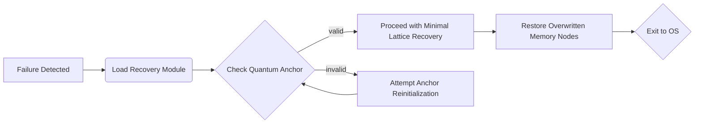

<!--
BLOOM Recovery System:
{
  "metadata": {
    "timestamp": "2025-05-28 22:45:14",
    "author": "isdood",
    "pattern_version": "1.0.0",
    "color_scheme": "GLIMMER"
  }
}
-->
````markdown name=SYSTEM.md
# BLOOM Recovery System Overview

The BLOOM Recovery System ensures device stability even in adverse conditions, leveraging quantum anchors, crystal-lattice mapping from scribble, and the star-like concurrency from GLIMMER within the STARWEAVE universe.

---
## 1. Core Goals
- **Reality Anchor Preservation**: Sustain stable anchor points throughout major device failures.
- **Quantum Resilience**: Leverage quantum entropy from the OS layer to secure cryptographic checks and integrity validations.
- **Crystal-Lattice Checks**: Borrow concurrency patterns from scribble’s advanced frameworks, aligning memory-lattice recovery with minimal overhead.
- **STARWEAVE Synergy**: Merge the star-like concurrency from GLIMMER with BLOOM’s quantum environment for reliable fallback strategies.

---
## 2. Architecture Highlights
1. **Bootloader Integration**: The Recovery System is closely tied to the bootloader, ensuring quick handoff during catastrophic failures.
2. **Quantum Anchor Engagement**: Recovers or reinitializes quantum anchors for consistent device state when bridging from normal to recovery mode.
3. **Crystal-Lattice Mapping**: Analyzes crystal memory nodes for corruption, referencing scribble’s HPC constructs to reinstate stable concurrency threads.

---
## 3. The Recovery Lifecycle

This flow demonstrates how the Recovery System encloses corrupted device states, attempts re-anchoring, and finally returns a stable environment back to the user.

---
## 4. Quantum & Crystal Interplay
- **Quantum Checks**: Prevent decoherence from carrying over post-recovery, ensuring the OS can start in a coherent state.
- **scribble HPC Patterns**: Cross-reference scribble’s concurrency approaches to expedite any needed memory re-allocations or re-initialization under load.
- **GLIMMER Scheduling**: A star-like concurrency approach that recovers tasks in parallel, re-anchoring each concurrency thread in stable intervals.

---
## 5. Sample Recovery Snippet
```zig
pub fn do_recover_lattice(mem: []u8, anchor_strength: f32) !void \{
    // Validate quantum anchor consistency
    // Cross-check crystal-lattice stabilization from scribble HPC models
    // Utilize GLIMMER concurrency to parallelize memory repairs
}
```

---
## 6. Future Improvements
- **Entangled Recovery**: Implement deeper quantum entanglement checks to fix partial corruption states automatically.
- **Improved Logging**: Expand logs for concurrency tasks during extreme device failure modes.
- **SCRIBBLE x GLIMMER**: Further unify HPC concurrency with star-like scheduling for faster fallback cycles.

````
